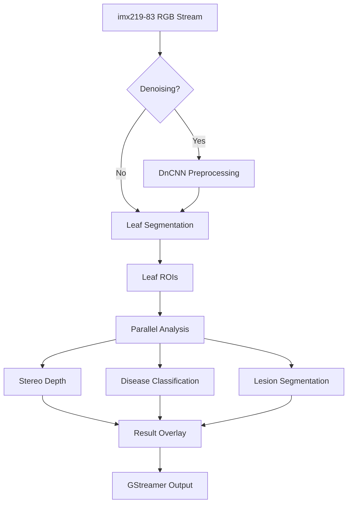

# Architecture

> Auto-generated by /map on 2026-02-18

## Overview

Potato disease detection system optimized for real-time inference on Raspberry Pi 5 with the Hailo-8L NPU. The system uses a multi-stage pipeline to identify leaves, estimate depth, and analyze disease states.

## Components

### Orchestrator
- **Purpose:** Manages the pipeline lifecycle, frame acquisition, and stage execution.
- **Location:** `orchestrator.py`
- **Dependencies:** `cv2`, `numpy`, `yaml`, `hailort`

### Leaf Segmentation
- **Purpose:** Identifies potato leaves and extracts Regions of Interest (ROIs).
- **Location:** `Leaf Segmentation/`
- **Model:** YOLOv8n-seg HEF (640x640)

### Infection Classification
- **Purpose:** Categorizes the disease type for each leaf ROI.
- **Location:** `Infection Classification/`
- **Model:** MobileNetV2 (224x224)

### Lesion Segmentation
- **Purpose:** Precisely maps disease lesions within identified leaves.
- **Location:** `Lesion Segmentation/`
- **Model:** UNet with MobileNetV2 backbone (256x256)

### Scripts
- **Purpose:** Contains validation and utility scripts for model verification and environment setup.
- **Location:** `scripts/`

## Data Flow

1. **Acquisition:** RGB stream captured from imx219-83 stereo module.
2. **Detection:** Stage 1 identifies leaves using YOLOv8n-seg.
3. **Analysis:** Stage 2 performs classification, lesion segmentation, and depth estimation in parallel on leaf crops.
4. **Output:** Visual overlays (boxes, masks, labels) are drawn on the original frame and streamed via GStreamer.

## Integration Points

| Service | Type | Purpose |
|---------|------|---------|
| Hailo-8L | NPU | Hardware acceleration for AI inference |
| GStreamer | Framework | Video stream handling and pipeline orchestration |
| Hailo TAPPAS | Library | Optimized post-processing and pipeline integration |

## Technical Debt

- [ ] HailoRT implementation in `orchestrator.py` is currently a placeholder (simulated in mock mode).
- [ ] Denoising stage is optional and may impact latency.
- [ ] Temporal smoothing for motion blur not fully implemented.

## Conventions

**Naming:** Python scripts use snake_case (`orchestrator.py`).
**Structure:** Dataset directories follow YOLO/PascalVOC conventions for masks and images.
**Testing:** Comprehensive validation scripts in `scripts/` for workflows, skills, and models.
