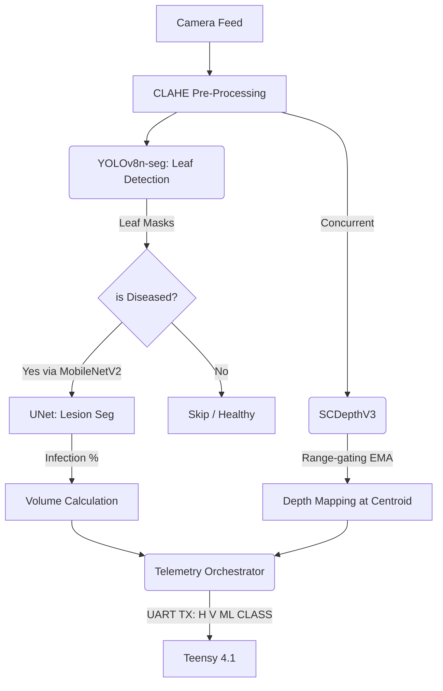
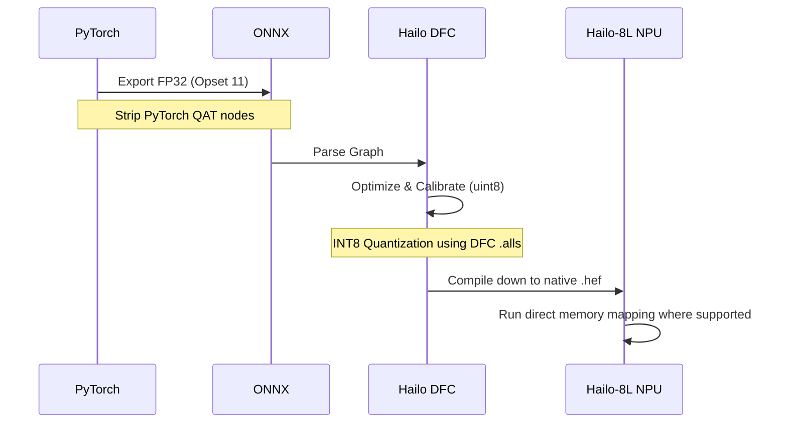

  <h1>🌱 KRISHI-EYE</h1>
  
<b>Advanced Edge-AI Smart Sprayer Pipeline</b> 
  <em>Powered by Hailo-8L, Raspberry Pi 5 & Teensy 4.1</em>

  
  
  
  
  

---

## 🌾 The Problem: Agricultural Spraying Inefficiency

Traditional agricultural spraying relies on blanket pesticide and fungicide application. This approach often results in unnecessary chemical application, leading to ecological runoff, accelerated pathogen resistance, and increased operational costs for farmers. Precision agriculture aims to solve this, but most modern computer vision solutions rely on cloud connectivity—which is often unreliable in rural fields—or struggle to run complex multi-model logic fast enough on low-power edge devices.

## 🎯 The Solution: KRISHI-EYE

**KRISHI-EYE** is a real-time, edge-based computer vision solution optimized for deployment directly on agricultural machinery (e.g., boom sprayers). 

Running strictly on-device using a **Raspberry Pi 5 paired with a Hailo-8L NPU accelerator**, the system captures live stereo video feeds, independently detects leaves, classifies their disease status, segments lesions, measures the physical distance to the target, and communicates highly specific micro-dosing and targeting instructions via UART to a Teensy-based nozzle control system.

---

## 🧠 Neural Architecture & Edge Deployment

KRISHI-EYE pushes four separate `.hef` (Hailo Executable Format) neural payloads through the Hailo NPU concurrently via round-robin scheduling across multiple inference streams. All models are natively INT8-quantized and configured to improve runtime efficiency and memory handling on edge hardware.

### 1. `YOLOv8n-seg` (Detection & Instance Segmentation)
Detects distinct plant leaves and wraps them in a bounding box, isolating the organic shape using a mask. This drastically narrows the compute area for downstream models.

### 2. `MobileNetV2` / `ResNet` (Pathology Classification)
Sorts the masked leaf segments into categories: *Bacteria, Fungi, Nematode, Pest, Phytophthora, Virus, or Healthy*. Employs **logit adjustments** and **class penalties** dynamically to counter real-world dataset over-fitting without requiring a full retrain.

### 3. `UNet` (Severity Gauge)
Runs exclusively if tissue is declared diseased. Performs pixel-wise assessment of necrosis/blight versus healthy tissue to establish an *Infection Percentage*. This percentage mathematically dictates fluid delivery volumes.

### 4. `SCDepthV3` (Monocular / Stereo Telemetry)
Continuously maps the Z-space distance to the target crop, filtering out invalid background vegetation and providing the ballistic targeting distance needed to orient the mechanical sprayer servos.

---

## ⚙️ Training to Deployment Pipeline

1. **ONNX Baseline:** All models are exported to FP32 ONNX formats with static input shapes.
2. **Hailo Execution Format (HEF):** Using the Hailo Dataflow Compiler (DFC) and subsets of `uint8` calibration imagery, the graphs are natively INT8 quantized for the Hailo-8L core.

---

## 🧰 Key Technical Features

*   **Spatial Cooldown De-duplication:** Prevents re-spraying of the same pathogen instance by enforcing a multi-frame spatiotemporal memory cooldown logic on the X/Y coordinate plane.
*   **Dynamic Lighting Robustness:** Real-time CLAHE (Contrast Limited Adaptive Histogram Equalization) pre-processing isolates shadow/glare variances common in turbulent outdoor fields.
*   **Hardware Fail-safes:** Depth maps aggressively fall back to *last known valid state trackers* to ensure mechanical safety if the NPU temporarily starves.
*   **Memory Optimization:** Utilizes pre-allocated numpy buffers to streamline communication with NPU PCIe endpoints.

---

## 📁 Repository Structure Overview

*(Note: Web application code and irrelevant training datasets have intentionally been excluded from evaluation uploads to provide a precise, targeted codebase).*

*   **`02_deployment/`**: The `main_edge_inference_pipeline.py` acts as the primary live inference pipeline managing UART outputs.
*   **`03_training/`**: Calibration scripts generating `uint8` dataset profiles necessary for INT8 conversion.
*   **`04_models/`**: Source FP32 `onnx/` files alongside the production-ready quantized `hef/` files.
*   **`07_hardware_calibration/`**: The Teensy 4.1 C++ firmware (`krishi_eye_teensy.ino`) and DFC profile performance reports.
*   **`08_docs/`**: Evaluator-focused documentation detailing the deep technical constraints, architecture, and technology stacks.

## 🚀 Evaluator Quick-Start

1. **Understand the Edge Goal:** Read `08_docs/ARCHITECTURE.md` to map data flows between the NPU and the physical sprayer.
2. **Examine the Code:** Open `02_deployment/main_edge_inference_pipeline.py`. This single script demonstrates the true multi-model synchronization capabilities of the platform, the telemetry output, and the robustness thresholding.
3. **Trace the Pipeline:** Check `04_models/hef` to verify the compiled network architectures and `07_hardware_calibration/` to see the Arduino-C physical hardware handler.

---
> 🏆 **Designed for precision edge computing.**  
> Built for agricultural sustainability, designed to support more targeted chemical application.
