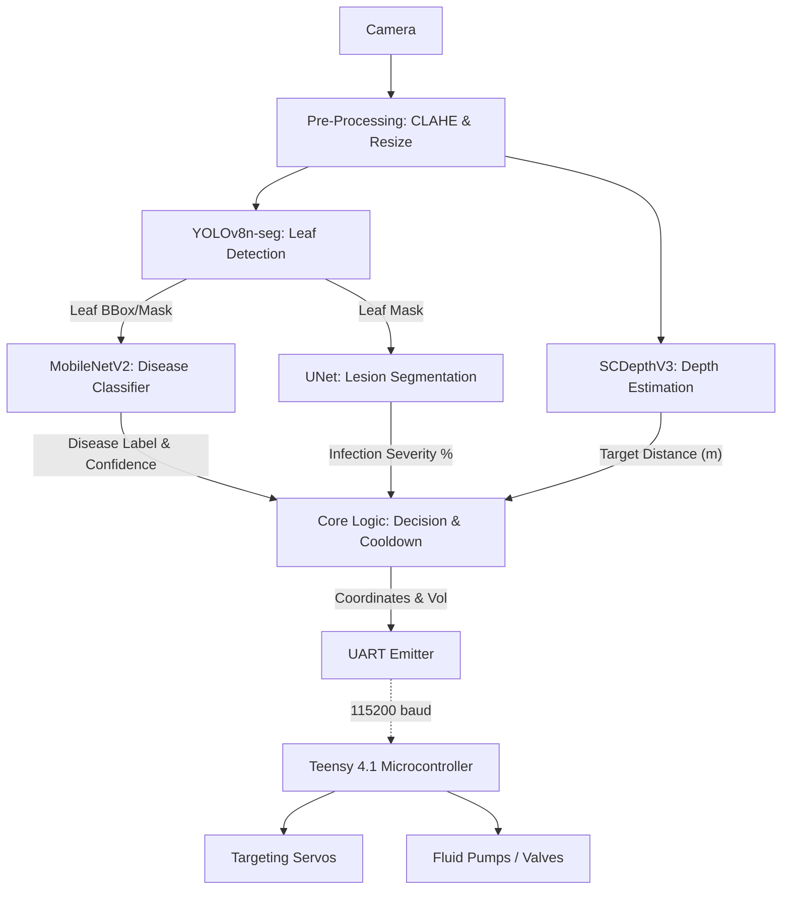

# Architecture

> Krishi-Eye Smart Sprayer Pipeline

## Overview
KRISHI-EYE is an edge-AI powered automated plant disease detection and pesticide spraying system designed to run on a Raspberry Pi 5 equipped with a Hailo-8L NPU. It uses a multi-model pipeline to detect leaves, classify diseases, segment lesions for severity estimation, and gauge distance via stereo depth estimation (SCDepthV3). The system then computes precise spray volumes and targeting coordinates, which are relayed over UART to a Teensy 4.1 microcontroller that coordinates custom 3D-printed sprayer servos.

## System Diagram

## Data Flow
1. **Input Generation**: High-resolution frames are captured via `rpicam-vid` or `v4l2`.
2. **Pre-Processing**: Frames undergo CLAHE (Contrast Limited Adaptive Histogram Equalization) to mitigate outdoor glare and shadow issues.
3. **Detection**: YOLOv8n-seg processes the image to find the individual potato leaves and generates a mask.
4. **Classification & Severity**: The crop segments are passed to the Classifier to identify specific diseases (e.g., Early Blight, Late Blight). If diseased, the segment is passed to UNet to compute the pixel-ratio of healthy vs. infected areas.
5. **Depth**: Simultaneously, SCDepthV3 generates a metric depth map of the frame. The depth at the centroid of the diseased leaf is sampled.
6. **Actuation Command Construction**: The system calculates the required pesticide mix (via disease label) and volume (via severity percentage and depth) and transforms the camera coordinates to servo angles.
7. **Execution**: A 10-field telemetry packet is generated and sent to the custom Teensy microcontroller via serial UART to actuate the hardware.

## Integration Points
| Hardware/Service | Protocol | Purpose |
|------------------|----------|---------|
| Raspberry Pi 5 | Base | Main Compute & Orchestration |
| Hailo-8L NPU | PCIe/M.2 | Hardware acceleration for the 4 Neural Networks |
| Teensy 4.1 | UART / USB-C | Hard-realtime motor and valve control |
| Camera Module | MIPI CSI | Realtime optical feed |

## Conventions
- **Naming:** PEP 8 standard with specific conventions for inference output layers.
- **Buffers:** Zero-copy pre-allocated continuous numpy arrays for maximum performance.
- **Scheduling:** Round Robin across the Hailo NPU to balance execution between the 4 loaded `.hef` models.
- **Concurrency:** The depth map inference runs on a background asynchronous thread to prevent main-loop blocking.

## Main Components
### `hailo_live_pipeline.py`
- **Purpose**: The main production script orchestrating the entire live feed structure.
- **Key Classes**: `HailoInference` (handles NPU interfacing), `DepthThread` (async depth processing), `UARTSender` (Teensy telemetry).

### `depth_test_hailo.py`
- **Purpose**: A standalone diagnostic script mapped specifically for tuning the SCDepthV3 depth network.

### `test_hailo_models.py`
- **Purpose**: The verification suite for quickly assessing whether the NPU and individual HEF model binaries are communicating correctly without initializing the full complex pipeline.
