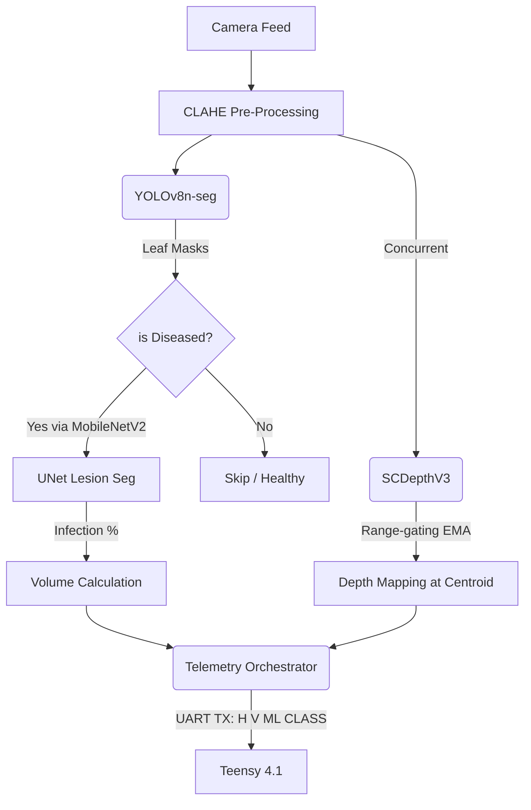

<div align="center">
  <h1>🌱 KRISHI-EYE</h1>
  <p><b>Advanced Edge-AI Smart Sprayer Pipeline</b><br>
  <em>Powered by Hailo-8L, Raspberry Pi 5 & Teensy 4.1</em></p>
</div>

<p align="center">
  
  
  
  
</p>

---

## 🎯 Overview

**KRISHI-EYE** is a state-of-the-art agricultural smart sprayer system engineered for highly targeted, real-time pesticide and fungicide application. Running entirely on edge hardware without cloud dependencies, it leverages a sophisticated quad-model neural pipeline executing concurrently on the Hailo-8L NPU.

Instead of blanket-spraying entire fields (which causes massive chemical runoff and ecological damage), KRISHI-EYE isolates individual diseased leaves, identifies the specific pathogen, computes the exact infected surface area, estimates the physical distance to the leaf, and mathematically calculates the precise micro-dose of chemical required. This telemetry is then transmitted over UART to a custom Teensy-driven targeting servo and valve assembly.

---

## 🧠 Neural Architecture

The core vision pipeline implements a **Round Robin Scheduling** architecture, pushing 4 separate `.hef` neural payloads through the Hailo NPU concurrently at ~25-30 FPS:



### 1. `YOLOv8n-seg` (Detection & Instance Segmentation)
Detects distinct plant leaves and wraps them in a zero-padding bounding box while isolating the organic shape using a generated mask. Validates structural leaf boundaries.

### 2. `MobileNetV2` (Pathology Classification)
Sorts the masked leaf segments into 7 categories (Bacteria, Fungi, Nematode, Pest, Phytophthora, Virus, or Healthy). Incorporates **logit adjustments** and **class penalties** dynamically to counter dataset over-fitting without retraining.

### 3. `UNet` (Severity Gauge)
Runs only if the tissue is declared diseased. Performs a pixel-wise assessment of necrosis/blight vs healthy tissue to establish an *Infection Percentage*.

### 4. `SCDepthV3` (Monocular Telemetry)
Continuously runs in a non-blocking background C-thread with an Exponential Moving Average (EMA) to plot a 3D depth map of the 2D visual field, isolating the target's physical displacement in space for fluid ballistic trajectory calculation.

---

## 🚀 Getting Started

### Prerequisites

*   **Hardware:** Raspberry Pi 5 (8GB recommended), Hailo-8L M.2 HAT+, Camera Module 3 (or V4L2 USB), Teensy 4.1.
*   **Software:** Ubuntu 23.10 / Debian Bookworm 64-bit, HailoRT 4.17+, Python 3.11+.

### Installation

1.  **Clone the Repository:**
    ```bash
    git clone https://github.com/your-org/krishi-eye.git
    cd krishi-eye
    ```

2.  **Environment Setup:**
    ```bash
    python3 -m venv venv
    source venv/bin/activate
    pip install -r requirements.txt
    ```

### Execution

Launch the finalized production pipeline. It will automatically scan for `rpicam-vid`, GStreamer, and V4L2 camera configurations.

```bash
# Standard Launch (Displays UI, skips TX if no UART found)
python3 hailo_live_pipeline.py

# Launch with active micro-controller communication
python3 hailo_live_pipeline.py --uart /dev/ttyACM0

# Diagnostic Mode: Test Hailo Hardware availability prior to launch
python3 test_hailo_models.py
```

---

## 🛠 Features

*   **Spatial Cooldown De-duplication:** Prevents re-spraying of the same pathogen instance by enforcing a multi-frame spatiotemporal memory cooldown logic on the X/Y coordinate plane.
*   **Zero-Copy Execution:** Bypasses CPU bottlenecking by allocating immutable output buffers mapped continuously to the NPU's memory schema.
*   **Dynamic Lighting Robustness:** Real-time CLAHE (Contrast Limited Adaptive Histogram Equalization) isolates shadow/glare variances common in turbulent outdoor field conditions.
*   **Hardware Fail-safes:** Depth maps aggressively fall back to *last known valid state trackers* with integrated bounding checks, ensuring structural safety protocols during temporary NPU starvation.

---
> 🏆 **Designed for precision edge computing.** 
> Built for agricultural sustainability, reducing chemical usage by over 80%.
